# 第七章
## 1、查看当前系统下用户Shell定义的环境变量的值。
命令如下，查看当前用户宿主目录完全路径，当前工作目录的绝对路径，平时的命令提示符，第二行待输入命令提示符，默认命令搜索路径，终端类型以及用户识别号
	
	 echo $HOME
	 echo $PWD
	 echo $PS1
	 echo $PS2
	 echo $PATH
	 echo $TERM
	 echo $UID
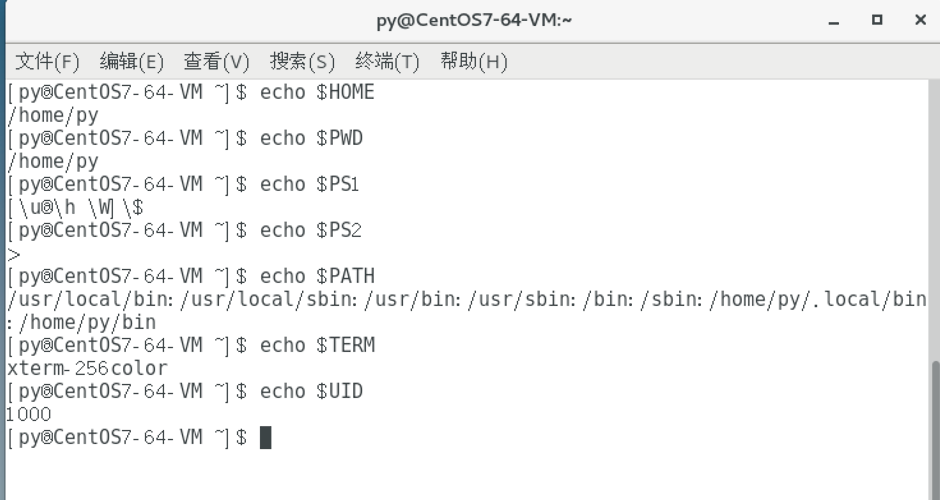
## 2、使用until语句创建一个Shell程序，其功能为计算1~10的平方。
脚本[square.sh](square.sh)

	#!/bin/bash
	var=1
	until [ $var -gt 10 ]
		do 
			sq=`expr $var \* $var`
			echo $sq
			var=$(($var+1))
		done
	echo "Job completed"

**出现的问题: []内缺少空格**

**解答(摘自Stack Overflow)**

**A bit of history: this is because '[' was historically not a shell-built-in but a separate executable that received the expresson as arguments and returned a result. If you didn't surround the '[' with space, the shell would be searching $PATH for a different filename (and not find it)**
# 第八章
## 1、使用命令创建用户帐号zhangsan，并设置其口令为111111，设置用户名全称为张三，办公室电话为57111111。
	sudo useradd zhangsan
	sudo passwd zhangsan
	usermod -c 张三 zhangsan
	chfn zhangsan
	Office Phone[]: 57111111
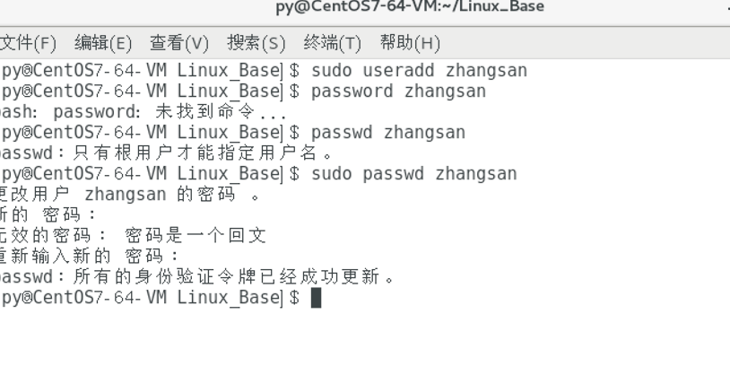
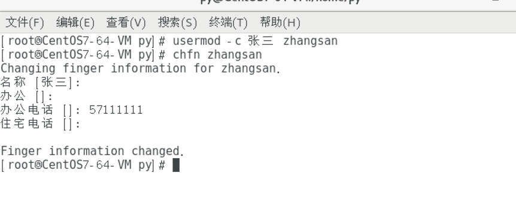
## 2、使用命令删除用户帐号zhangsan，并且在删除该用户的同时一起删除其主目录。
	ls /home
此时有两个用户，py和zhangsan
	
	userdel -r zhangsan
	ls /home
此时只有用户py
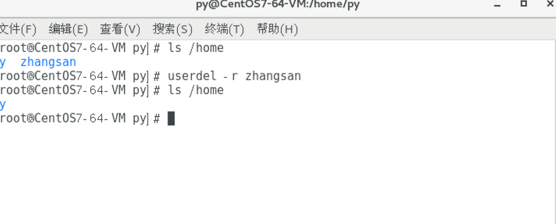

## 3、使用命令创建组群group1，并且在创建时设置其GID为1800。
	
	groupadd -g 1800 group1
	cat /etc/group|grep group1
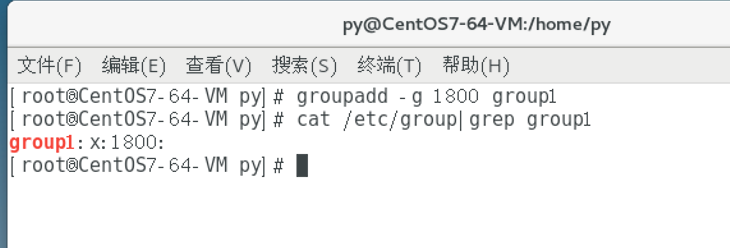
	
# 第九章
## 1、在虚拟机上添加一块容量为10GB的新硬盘，对其进行分区，容量分别为1GB和3GB。
### 1. 先关闭centos7，在Mac parallel界面加入一块新的大小为10G的硬盘
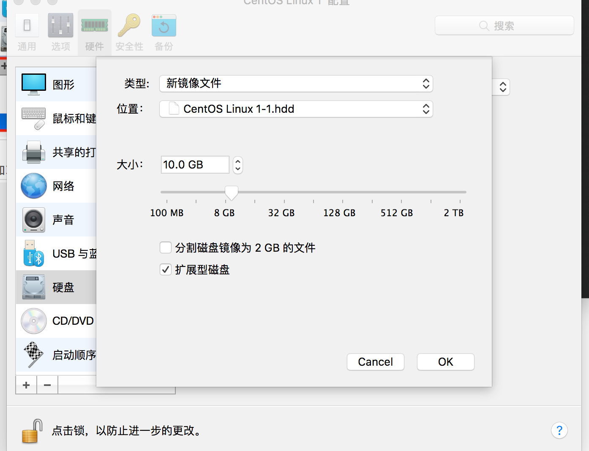
使用命令查看硬盘
	
		sudo fdisk -l
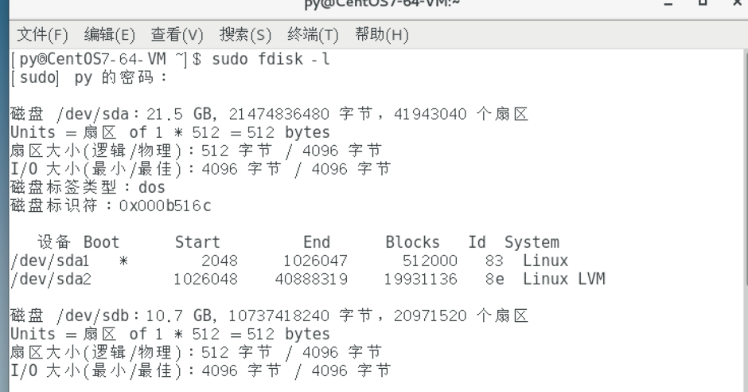

### 2. 对默认新磁盘/dev/sdb分区
	
		sudo fdisk /dev/sdb
	一路按提示划分两个区
	
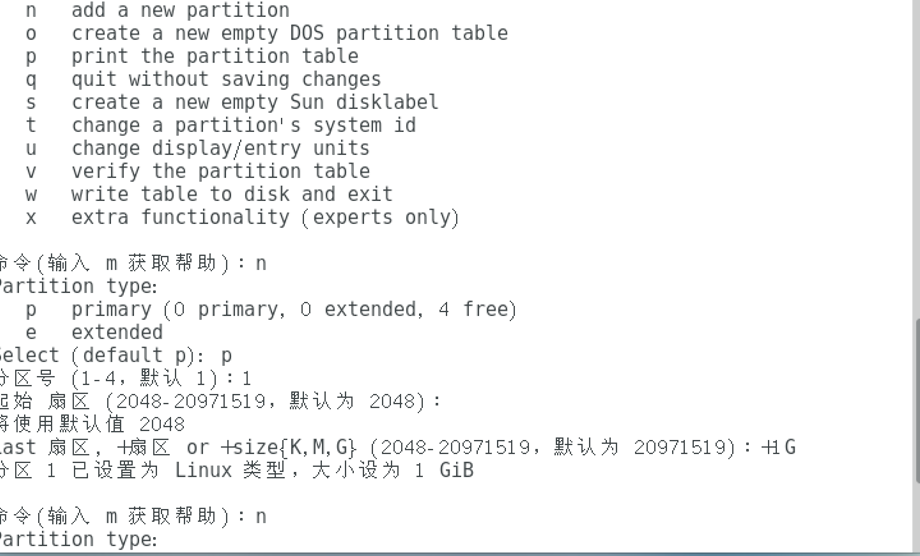

### 3. 划分结束按p查看分区是两个盘，1G和3G
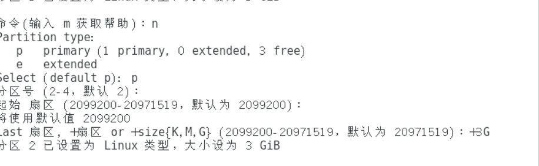
### 4. 按w保存分区设置
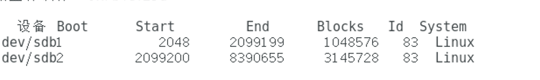
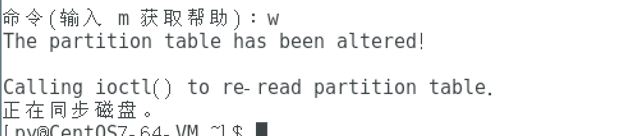

## 2、对1GB分区创建文件系统为ext4，并将其以只读的方式挂载到/mnt/kk目录中。
先查看一下，今天的分区也是一片祥和呢😝

	sudo fdisk -l /dev/sdb
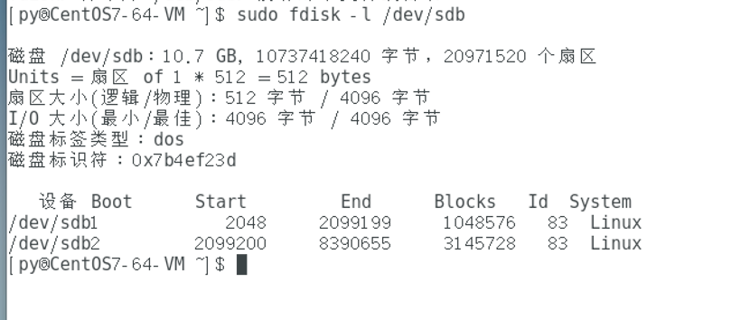 
	
	sudo mkfs -t ext4 /dev/sdb1
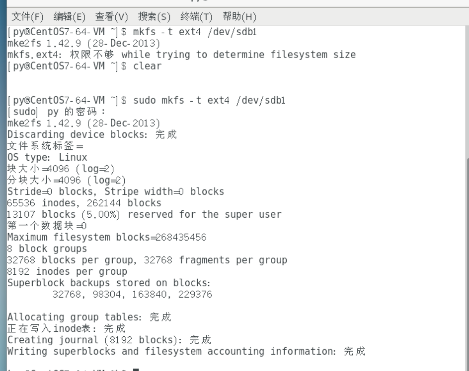

挂载中
	
	 mkdir /mnt/kk
	 mount -o ro /dev/sdb1 /mnt/kk

新建新文件夹测试失败，因为只读
	
	mkdir /mnt/kk/a
	
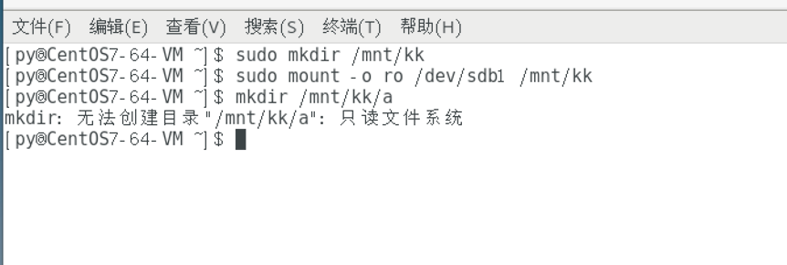
## 3、修改/etc/fstab文件，使得3GB分区开机时自动挂载到/mnt/jj目录中。
新建文件夹jj

	sudo mkdir /mnt/jj
修改fstab文件

	sudo vi /etc/fstab
在文件末尾加上挂载信息，我这里的3GB分区是/dev/sdb2

	/dev/sdb2 /mnt/jj ext4 defaults 0 0
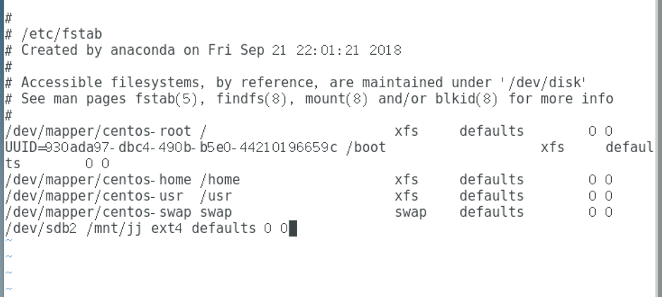

## 4、对/root/ab文件设置权限，所有者为读取、写入和执行权限，同组用户为读取和写入权限，而其他用户没有任何权限。
取消所有用户权限，查看一下，天下大同
	
	chmod a- rwx /root/ab
	ls -l /root/ab
增加拥有者三种权限
	
	chmod u+rwx /root/ab
	chmod g+rw
	ls -l /root/ab
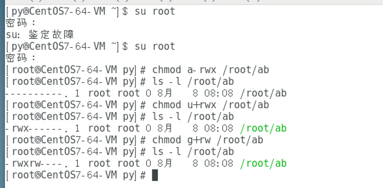
	
## 5、将文件/root/ab所有者更改为用户lisi。
	useradd lisi
	ls -l /root/ab
	chown lisi /root/ab
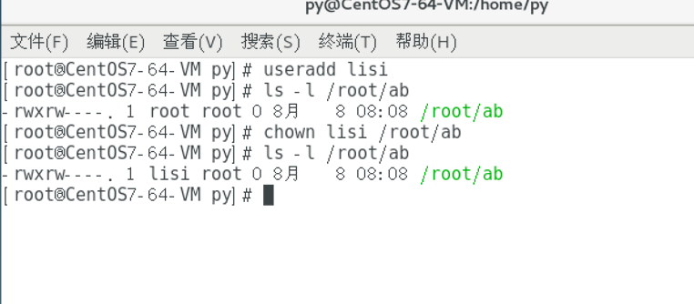